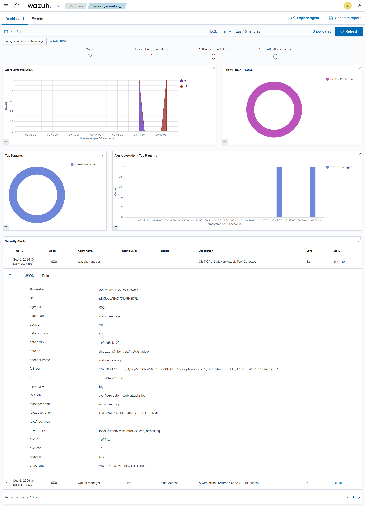
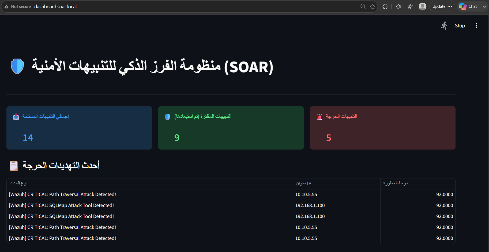
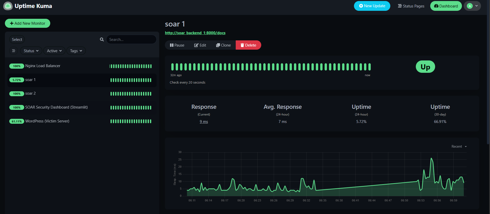
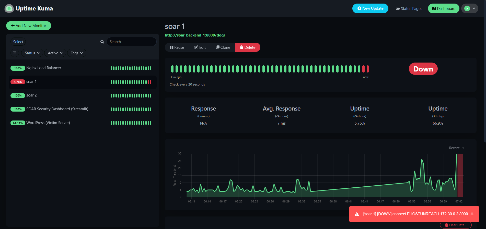
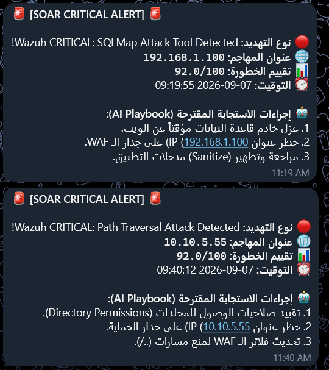

# النظام الذكي لأتمتة وتنسيق الاستجابة الأمنية (Smart SOAR) بتوافرية عالية
*Enterprise-Grade Smart SOAR System with High Availability*

## 🚀 نبذة عن المشروع
يهدف هذا المشروع إلى معالجة تحدي "الإرهاق من التنبيهات" (Alert Fatigue) في مراكز العمليات الأمنية (SOC). يقوم النظام بأتمتة عملية الفرز (Triage)، تصفية الضوضاء، وتوليد مسارات استجابة ديناميكية (Playbooks) باستخدام الذكاء الاصطناعي (Gemini AI). تم بناء النظام بمعايير المؤسسات الكبرى (Enterprise-Grade) لضمان التوافرية العالية (High Availability) واستمرارية العمل دون انقطاع (Zero Downtime).

## 🏗️ المعمارية التقنية (System Architecture)
يعتمد النظام بالكامل على حاويات (Docker) ويتكون من:
- **Wazuh (SIEM):** لجمع السجلات واكتشاف التهديدات الحرجة عبر قواعد مخصصة.
- **Nginx (Load Balancer):** لتوزيع التنبيهات بخوارزمية Round-Robin.
- **FastAPI (SOAR Engine):** محرك المعالجة المزدوج لتقييم المخاطر وتحديد الاستجابة.
- **Streamlit (SOC Dashboard):** لوحة قيادة تفاعلية لمحللي الأمن.
- **Uptime Kuma:** لمراقبة صحة النظام وحالة الحاويات.
- **Telegram Bot API:** لإرسال التنبيهات وخطط الاستجابة (Playbooks) بشكل فوري.

## 📸 معرض الصور (Screenshots)

### 1. شاشة اكتشاف التهديدات (Wazuh Dashboard)
تُظهر التقاط التهديدات الحرجة وتصنيفها في المستوى 12.


### 2. لوحة قيادة العمليات الأمنية (Streamlit SOC Dashboard)
توضح التنبيهات المستلمة، المفلترة (تقليل الضوضاء)، والتنبيهات الحرجة مع درجات الخطورة.


### 3. اختبار التوافرية العالية واستمرارية العمل (Uptime Kuma - Chaos Test)
**الحالة الأولى (استقرار النظام):** الحاوية `soar_backend_1` تعمل بشكل طبيعي.


**الحالة الثانية (انهيار محاكى):** إيقاف الحاوية عمداً، حيث يقوم Nginx بتحويل التنبيهات للحاوية الثانية لضمان استمرارية الخدمة.


### 4. إشعارات الاستجابة الذكية (Telegram AI Playbooks)
الإشعارات اللحظية الواصلة للمحلل وتوضح أدلة الاستجابة المارنة المعتمدة على الذكاء الاصطناعي.


## 💡 المميزات والنتائج
- **تقليل الضوضاء (Noise Reduction):** تصفية الهجمات الروتينية بصمت.
- **استجابة ديناميكية:** توليد خطط استجابة مخصصة عبر الذكاء الاصطناعي.
- **مرونة مطلقة:** قدرة النظام على تحمل سقوط الخادم الرئيسي مع الاستمرار في العمل دون فقدان البيانات (High Availability).

## 🛠️ كيفية التشغيل
```bash
# بناء وتشغيل الحاويات في الخلفية
docker compose up -d --build
```
